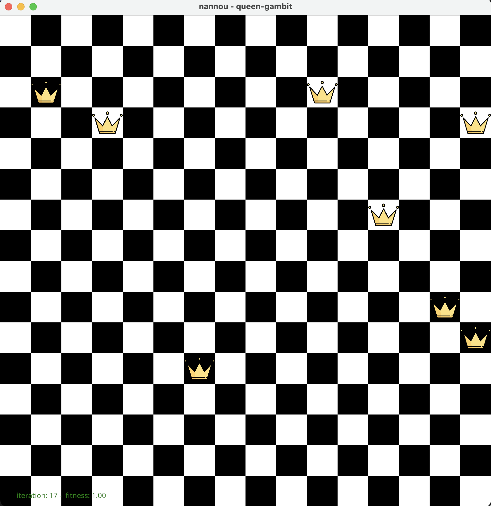

# ♟️ Chess Evolution Simulator

Welcome to the **Chess Evolution Simulator**. This project simulates the evolution of chess strategies using a genetic algorithm approach to solve the classic N-Queens Problem. It visualizes the process of selection and mutation in a chessboard environment.

## 📚 Overview

The **Chess Evolution Simulator** demonstrates the principles of genetic algorithms through a chessboard simulation. It uses the `nannou` framework for graphical representation and `rand` for randomness in genetic operations. The project illustrates how queens on a chessboard can evolve over iterations to optimize their positions based on fitness evaluations, aiming to solve the N-Queens Problem.

<p align="center">
  
</p>

## 🌟 Features

- **Chessboard Visualization**: Displays the chessboard and updates it in real-time with each iteration.
- **Genetic Algorithm Operations**: Implements crossover and mutation to evolve queen positions towards a solution of the N-Queens Problem.
- **Performance Metrics**: Outputs statistics such as best, worst, and average scores over iterations.

## 🛠️ Installation

To get started with the **Chess Evolution Simulator**, follow these steps:

1. **Clone the repository**:
   ```bash
   git clone https://github.com/elamribadrayour/queen-gambit.git
   ```

2. **Navigate to the project directory**:
   ```bash
   cd queen-gambit
   ```

3. **Build the project**:
   ```bash
   cargo build --release
   ```

4. **Run the application**:
   ```bash
   cargo run --release
   ```

## 📄 License

This project is licensed under the [MIT License](LICENSE).

## 📞 Contact

For any inquiries or feedback, please reach out to me at [badrayour.elamri@protonmail.com].

---

Thank you for your interest in the **Chess Evolution Simulator**. We hope you find it educational and engaging.
